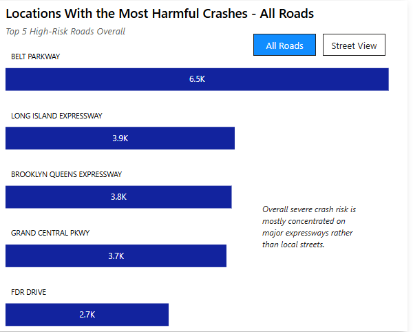
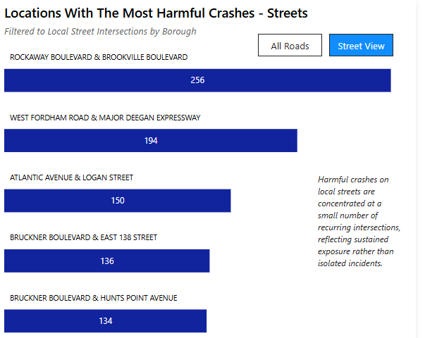

# Project Overview
New York City leadership relies on motor vehicle collision data to guide traffic safety policy, infrastructure planning, and enforcement strategies. With thousands of crashes occurring each year, understanding **where** severe collisions happen, **who** is most affected, and how **risk varies across boroughs** is critical for prioritizing interventions and allocating resources effectively. This analysis uses NYC crash data to provide a borough-level perspective on injuries and fatalities, supporting data-driven decisions aimed at improving street safety and reducing preventable loss of life.

Key areas that fueled insights and targeted recommendations include:
 - **Crash Trends Over Time:** Analyze long-term crash volume trends to distinguish sustained changes from short-term fluctuations.

 - **Borough-Level Risk and Severity:** Use risk-adjusted severity metrics to compare borough safety beyond raw crash counts.

 - **Vulnerable Road Users:** Assess injury and fatality risk for pedestrians, cyclists, and motorists to highlight disproportionate impacts.

 - **Contributing Factors:** Examine leading crash causes and how they vary across boroughs to inform targeted interventions.

 - **High-Risk Locations:** Identify streets and intersections with concentrated crash severity rather than just high volume.

An interactive dashboard in Power BI can be downloaded [here.](https://drive.google.com/file/d/1h-DyTfiRkmvLYc7xEawxuxmlFAAT9Ip6/view?usp=sharing)

The SQL queries used to clean, structure, and stage the data for analyzing can be viewed [here.](nyc-crash-data-cleaning.sql)

The SQL queries used to analyze overall data trends and specific insights can be viewed [here.](nyc-crash-data-analysis.sql)

An Excel workbook containing an issue log while data cleaning can be viewed [here.](nyc-crashes-issue-log.xlsx)

---

# Data Structure
The source dataset contains just over 2.2 million crash records and was originally structured as a wide, single-table file. For analytical clarity and scalability, the data was reorganized into a logical star schema centered on crash-level events.

### Fact Table
 - The core table, fact_crash, is defined at the grain of one row per collision (collision_id). It stores crash timing, borough, injury and fatality counts by road user type, derived severity labels, and data quality flags. This ensures that normalized metrics such as fatalities per 10,000 crashes are calculated consistently at the correct aggregation level.

### Dimensions & Bridge Tables
 - Descriptive attributes were separated into logical dimension tables, including borough, location, contributing factors, and vehicle types. Because crashes may involve multiple contributing factors and vehicle types, many-to-many bridge tables were introduced to replace repeating columns (e.g., factor_1–factor_5).

In practice, these dimensions and bridge structures are implemented as derived SQL views built from the crash-level fact table. This approach preserves the raw dataset while enforcing a clean analytical schema optimized for BI reporting.

**

---

# Data Quality Improvement
A substantial number of crash records lacked a reported borough despite containing valid latitude and longitude coordinates. To resolve this, borough values were derived using a geospatial point-in-polygon method, matching crash locations to official NYC borough boundary polygons. This approach allowed boroughs to be assigned deterministically based on geographic location rather than relying on incomplete or inconsistent source fields.

The process was implemented in Python to efficiently handle large-scale spatial joins. Only records with missing boroughs and valid coordinates were evaluated, preserving original data while improving completeness. Derived values were flagged for transparency, and crashes without sufficient geographic information were intentionally left unassigned. This enrichment significantly improved borough-level data quality and enabled more accurate severity and risk comparisons across boroughs.

The Python code used to accomplish this task can be viewed [here.](nyc-crashes-borough-fix.ipynb)

---

# Executive Summary

## Overview of Findings
Overall crash volume in New York City peaked in 2018–2019 before declining by nearly 60% between 2020 and 2024. However, this reduction in crash frequency has not translated into proportional improvements in safety outcomes. While total crashes fell sharply following COVID-related travel shifts, crashes resulting in injury or death rebounded more quickly, and fatal risk per crash increased across boroughs and road user groups. These patterns indicate that fewer crashes have not necessarily resulted in safer conditions, highlighting the importance of monitoring severity, not just volume when evaluating traffic safety progress.

## Severity–Volume Divergence
 - Total crash volume peaked in 2018–2019, then declined sharply (≈60%) after 2020.
 - Harmful crashes (injury or death) rebounded faster than total crashes post‑2020.
 - Fatal crash risk per 10,000 crashes increased across boroughs and road user groups.
 - Fewer crashes did not translate into proportionally safer outcomes, underscoring the need to track severity—not just volume.

**
**

## Borough-Level Severity Disparities
 - Fatal crash risk varies significantly across boroughs when normalized per 10,000 crashes.
 - Staten Island consistently shows the highest fatal risk across pedestrians, cyclists, and motorists.
 - Brooklyn and Manhattan show lower fatal risk per crash despite high crash volume.
 - Borough rankings remain stable over time, suggesting structural differences rather than temporary fluctuations.

**

## Vulnerable Road Users

 ### Motorists
 - Fatal risk declined through 2018, then increased sharply after 2020, reversing prior improvements.
 - Post-2020 risk remains elevated relative to the 2015–2018 period.
 - Staten Island shows the highest motorist fatal risk (56.5 per 10,000 crashes), while Manhattan and Brooklyn show the lowest.
 - Borough gaps exceed 20 fatalities per 10,000 crashes, indicating persistent structural differences.

**
**

 ### Cyclists
 - Cyclist fatal risk is more volatile year-to-year than motorists.
 - The rolling average increases after 2020 and remains above pre-2018 levels.
 - Staten Island and the Bronx show the highest cyclist fatal risk, while Manhattan shows the lowest.
 - Borough disparity is widest for cyclists, with nearly a 30-point gap between highest and lowest boroughs.

**
**

### Pedestrians
 - Pedestrians face the highest fatal risk per crash—roughly three times that of motorists and cyclists.
 - Fatal risk increases significantly after 2020 and remains elevated.
 - Staten Island and Queens show the highest pedestrian fatal risk, while Manhattan remains lowest.
 - Borough differences are substantial, with over 40 fatalities per 10,000 crashes separating highest and lowest areas.

**
**

## Temporal Risk Concentration
 - Harmful crashes cluster heavily during weekday afternoons and early evenings (2–7 PM).
 - Evening commute hours show higher harmful crash counts than morning commutes.
 - Tuesday–Friday evenings exhibit the strongest concentration.
 - These patterns indicate predictable temporal risk windows rather than random variation.

**

## Behavioral Drivers of Harm
 - Driver inattention and distraction are the leading contributors to injury‑ and fatal‑involved crashes.
 - Failure to yield and following too closely are the next most common factors.
 - Behavioral and interaction‑based errors account for the majority of harmful crashes.
 - Unsafe speed appears less frequently but remains strongly associated with severe outcomes.

**

## Geographic Concentration
 - Harmful crashes are unevenly distributed across the street network.
 - Major expressways account for a disproportionate share of severe crashes.
 - A small number of recurring intersections consistently show elevated harmful crash counts.
 - Crash harm clusters in persistent corridors and hotspots rather than isolated, one‑off locations.

**
**

# Recommendations

### Severity-Based Performance Metrics
 - Shift performance tracking from total crash counts to severity-adjusted metrics. Because harmful crashes rebounded faster than total crashes post-2020, agencies should prioritize indicators such as harmful crashes per 1,000 crashes and fatalities per 10,000 crashes to more accurately evaluate safety outcomes.

### Vulnerable Road User Protections
 - Prioritize pedestrian-focused safety investments. Pedestrians face roughly three times the fatal risk per crash compared to motorists and cyclists. Expanding traffic-calming measures, protected crossings, daylighted intersections, and speed-reduction interventions in high-foot-traffic areas would directly address the highest-severity outcomes.

### Time-Based Enforcement and Design
 - Align enforcement, signal timing, and temporary traffic controls with predictable high-risk windows (2–7 PM, especially Tuesday through Friday) to maximize the impact of limited safety resources.

### Corridor- and Borough-Specific Interventions
 - Focus safety investments on high-risk corridors and high-severity boroughs. Major expressways account for a disproportionate share of harmful crashes, and Staten Island consistently exhibits the highest fatal risk across user groups. Targeted corridor redesigns and speed management strategies in these areas would address concentrated severity rather than distributing resources evenly across the network.
