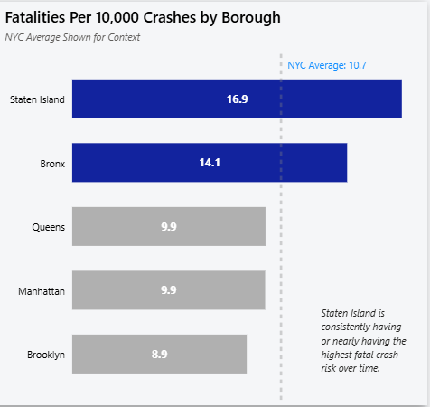
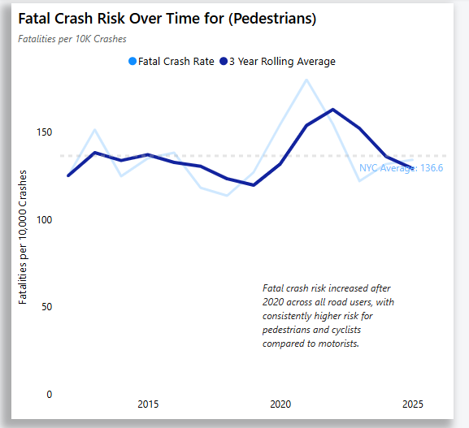
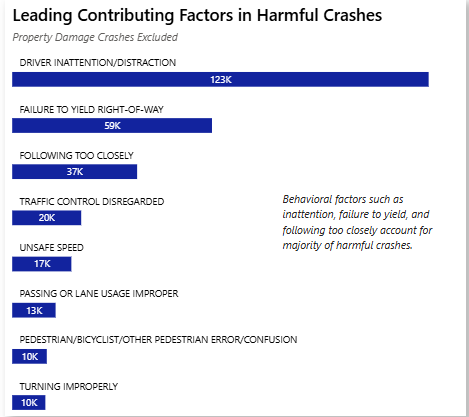

## Project Overview
New York City leadership relies on motor vehicle collision data to guide traffic safety policy, infrastructure planning, and enforcement strategies. With thousands of crashes occurring each year, understanding **where** severe collisions happen, **who** is most affected, and how **risk varies across boroughs** is critical for prioritizing interventions and allocating resources effectively. This analysis uses NYC crash data to provide a borough-level perspective on injuries and fatalities, supporting data-driven decisions aimed at improving street safety and reducing preventable loss of life.

Key areas that fueled insights and targeted recommendations include:
 - **Crash Trends Over Time:** Analyze long-term crash volume trends to distinguish sustained changes from short-term fluctuations.

 - **Borough-Level Risk and Severity:** Use risk-adjusted severity metrics to compare borough safety beyond raw crash counts.

 - **Vulnerable Road Users:** Assess injury and fatality risk for pedestrians, cyclists, and motorists to highlight disproportionate impacts.

 - **Contributing Factors:** Examine leading crash causes and how they vary across boroughs to inform targeted interventions.

 - **High-Risk Locations:** Identify streets and intersections with concentrated crash severity rather than just high volume.

An interactive dashboard in Power BI can be downloaded [here.](https://drive.google.com/file/d/1y8I7H01LmZmtQRFTuctt0C7xpPFn6NsH/view?usp=sharing)

The SQL queries used to clean, structure, and stage the data for analyzing can be viewed [here.](nyc_crash_data_cleaning.sql)

The SQL queries used to analyze overall data trends and specific insights can be viewed [here.](nyc_crash_data_analysis.sql)

An Excel workbook containing an issue log while data cleaning can be viewed [here.](nyc_crashes_issue_log.xlsx)

---

### Data Structure

---

### Data Quality Improvement
A substantial number of crash records lacked a reported borough despite containing valid latitude and longitude coordinates. To resolve this, borough values were derived using a geospatial point-in-polygon method, matching crash locations to official NYC borough boundary polygons. This approach allowed boroughs to be assigned deterministically based on geographic location rather than relying on incomplete or inconsistent source fields.

The process was implemented in Python to efficiently handle large-scale spatial joins. Only records with missing boroughs and valid coordinates were evaluated, preserving original data while improving completeness. Derived values were flagged for transparency, and crashes without sufficient geographic information were intentionally left unassigned. This enrichment significantly improved borough-level data quality and enabled more accurate severity and risk comparisons across boroughs.

The Python code used to accomplish this task can be viewed [here.]

---

### Executive Summary
Analysis of New York City collisions shows that overall crash volume peaked in 2018–2019 before declining by nearly 60% between 2020 and 2024. However, reductions in crash volume have not translated into proportional reductions in crash severity, and meaningful differences in risk persist across boroughs, locations, and road user groups. While the initial decline during the early 2020s aligns with COVID-19 travel restrictions, subsequent trends indicate that fewer crashes have not necessarily resulted in safer outcomes.

Placed below is the home/overview page of the corresponding dashboard, highlighting the big picture of the analysis. The full dashboard can be downloaded [here.](https://drive.google.com/file/d/1y8I7H01LmZmtQRFTuctt0C7xpPFn6NsH/view?usp=sharing)

**

### Crash Trends
 - City-wide crashes peaked in 2018, with 231,564 reported collisions, 61,940 injuries, and 231 deaths, meaning that about 27% of crashes resulted in injury or death (about 1 in 4). 
 - Despite a decline in overall crash volume, crashes resulting in injury or death have trended upward, indicating that recent reductions in crashes have not translated into safer outcomes.
 - Harmful crashes are most concentrated during the late afternoon and early evening (2-7pm), occurring most frequently from Tuesday through Saturday.

**
**
**

### Borough-Level Risk
 - While harmful crash volumes declined sharply after 2019, fatal crash risk increased across all boroughs beginning in 2020, indicating that crashes became less frequent but more severe.
 - 

**

### Vulnerable Road Users
 - Pedestrians have the highest fatal crash risk per 10,000 crashes among all road users, 3.5x more, compared to motorists and cyclists.
 - Motorists dominate injury counts and represent ~41% of all fatalities, driven by high exposure rather than elevated severity per crash.
 - Staten Island consistently ranks at the top for highest fatal crash risk per 10,000 crashes, across all road users.

** 
**

### Contributing Factors
Driver inattention and distraction is the most common contributing factor in harmful crashes.
Among crashes resulting in injury or death, driver inattention is cited more frequently than any other contributing factor, making it the dominant behavioral driver of crash harm citywide.

Most harmful crashes are driven by interaction-based driving errors.
After inattention, failure to yield right-of-way and following too closely are the next most common factors, indicating that conflicts between road users—rather than isolated mistakes—drive a large share of serious crashes.

Speed-related factors amplify severity despite lower frequency.
Unsafe speed appears less often than inattention or yielding failures, but when present it is disproportionately associated with injuries and fatalities, increasing the likelihood that a crash results in severe harm.

Behavioral factors outweigh mechanical or environmental causes.
The majority of crashes resulting in injury or death are associated with driver behavior rather than vehicle defects or roadway conditions, highlighting enforcement, street design, and behavior-focused interventions as the most effective levers for reducing crash severity.

These patterns suggest that enforcement and street design interventions targeting driver behavior will be more effective than vehicle- or environment-focused strategies alone.

**

### High-Risk Corridors & Locations
Harmful crashes are disproportionately concentrated on major expressways.
The highest counts of crashes resulting in injury or death occur along high-capacity corridors such as the Belt Parkway, Long Island Expressway, and Brooklyn–Queens Expressway.

High-risk locations reflect sustained exposure rather than isolated danger points.
Locations with the most harmful crashes are repeatedly occurring corridors and intersections, indicating that crash harm is driven by continuous traffic volume and speed rather than one-off hazardous sites.

Expressway crashes are associated with higher severity outcomes.
Crashes occurring on expressways are more likely to result in injury or death compared to local streets, consistent with higher travel speeds and limited recovery margins.

Local streets still account for a broad and persistent injury burden.
While expressways dominate the most severe crash locations, the majority of harmful crashes occur across the wider local street network, underscoring the need for citywide safety interventions in addition to corridor-specific fixes.

**

### Recommendations

Severity-Based Performance Metrics
 - Shift performance tracking from crash counts to severity-based metrics. While total crashes have declined, crashes resulting in injury or death have increased, indicating that volume-based measures alone are insufficient. City agencies should prioritize metrics such as harmful crashes per 1,000 crashes and fatalities per 10,000 crashes to more accurately evaluate safety outcomes and identify emerging risk.

Vulnerable Road User Protections
 - Prioritize protections for vulnerable road users, particularly pedestrians. Pedestrians face substantially higher fatal risk per crash compared to other road users. Expanding traffic-calming measures, protected crossings, daylighted intersections, and speed-reduction interventions in pedestrian-heavy areas would directly address the highest-severity outcomes.

Time-Based Enforcement and Design
 - Target enforcement and street design changes during predictable high-risk periods. Harmful crashes consistently peak during late afternoon and early evening hours (2–7 PM), particularly from Tuesday through Saturday. Aligning enforcement, signal timing, and temporary traffic management measures with these high-risk windows would maximize the impact of limited safety resources.

Corridor- and Borough-Specific Interventions
 - Focus safety interventions on high-risk corridors and borough-specific needs. Major expressways account for a disproportionate share of harmful crashes, while borough-level fatal risk varies significantly across the city. Targeted corridor redesigns, speed management strategies, and borough-specific safety plans—particularly in Staten Island—are necessary to address uneven risk distribution and reduce severe crash outcomes.

### Additional Notes

